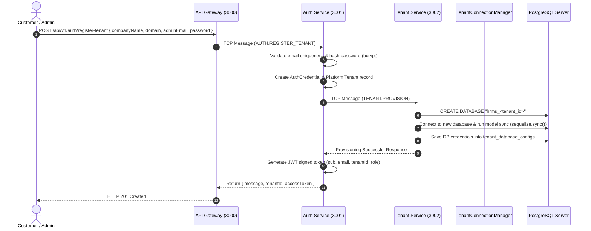
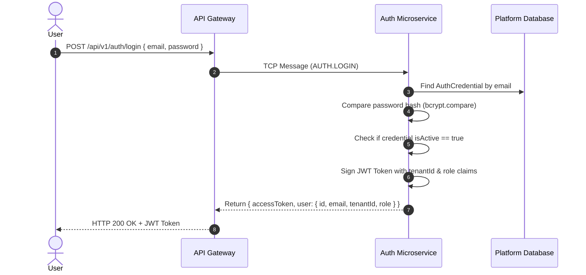
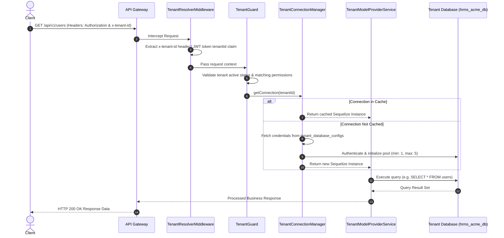
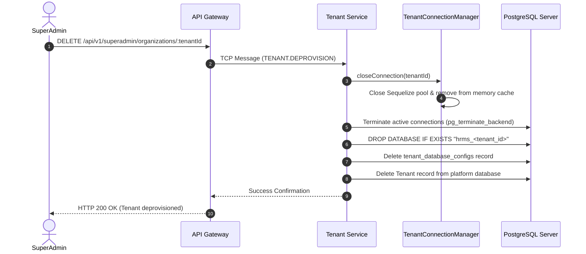

# End-to-End Organization (Tenant) Lifecycle & Execution Flow

> **Document Version**: 1.0.0  
> **Platform**: HRMS Multi-Tenant Microservices System  
> **Target Audience**: Software Engineers, System Architects, & DevOps Engineers  

---

## 1. Overview

This document details the complete end-to-end **Organization (Tenant) Lifecycle Flow** within the HRMS Multi-Tenant Platform. It covers every stage from organization onboarding and automated database provisioning to request context resolution, RBAC permission checks, dynamic connection pooling, and organization deprovisioning.

---

## 2. High-Level Architecture Flowchart

```
┌──────────────────────────────────────────────────────────────────────────────────┐
│                               1. ONBOARDING PHASE                                │
│                                                                                  │
│   Client/User ──────► API Gateway ──────► Auth Microservice ───► Tenant Service │
│                           (Port 3000)        (Port 3001)           (Port 3002)   │
│                                                                      │           │
│                                                                      ▼           │
│                                                          CREATE DATABASE         │
│                                                          hrms_<tenant_id>        │
└──────────────────────────────────────────────────────────────────────┬───────────┘
                                                                       │
┌──────────────────────────────────────────────────────────────────────▼───────────┐
│                               2. REQUEST PHASE                                   │
│                                                                                  │
│   Client Request ───► TenantResolverMiddleware ───► TenantGuard                   │
│   (x-tenant-id)               │                            │                     │
│                               ▼                            ▼                     │
│                   TenantConnectionManager       TenantModelProviderService       │
│                           │                            │                         │
│                           ▼                            ▼                         │
│               [ Get/Cache Tenant DB Connection ] ──► [ Query Tenant Database ]  │
└──────────────────────────────────────────────────────────────────────────────────┘
```

---

## 3. Step-by-Step Execution Phases

---

### Phase 1: Organization Onboarding & Database Provisioning

The onboarding flow can be triggered either via **Public Self-Service Sign-up** (`POST /api/v1/auth/register-tenant`) or **SuperAdmin Admin Portal** (`POST /api/v1/superadmin/organizations/onboard`).



#### Detailed Breakdown:
1. **Request Reception**: Client submits organization registration payload containing `companyName`, `domain`, `adminEmail`, `password`, `firstName`, and `lastName`.
2. **Credential Validation & Hashing**: Auth Service checks if `adminEmail` is already registered. If valid, hashes the password using `bcrypt`.
3. **Platform Credential Creation**: Creates an `AuthCredential` record mapping the user to a uniquely generated `tenantId` (`tenant-<domain>`).
4. **Database Provisioning (`TenantProvisioningService`)**:
   - Executes SQL statement: `CREATE DATABASE "hrms_<tenant_id>";`
   - Initializes connection to `hrms_<tenant_id>` and runs `sequelize.sync({ force: false })` to create all required tables (`users`, `roles`, `departments`, `employee_profiles`, `tasks`, etc.).
   - Stores connection configuration (`host`, `port`, `dbName`, `username`, `password`) in the platform `tenant_database_configs` table.
5. **JWT Issuance**: Signs a JWT containing contextual claims:
   ```json
   {
     "sub": "user-uuid-1234",
     "email": "admin@acme.com",
     "tenantId": "tenant-acme",
     "role": "Admin"
   }
   ```

---

### Phase 2: User Authentication & Login Flow



---

### Phase 3: Tenant Request Resolution & Database Connection Isolation

Every incoming operational request for an organization must be scoped to that specific organization's database.



#### Key Technical Components:
- **`TenantResolverMiddleware`**: Reads the `x-tenant-id` header or decodes bearer JWT token claims to determine tenant context.
- **`TenantConnectionManager`**: Maintains an in-memory Map (`Map<string, Sequelize>`) of active database connection pools. This guarantees high performance without reconnecting on every HTTP request.
- **`TenantModelProviderService`**: Dynamically binds Sequelize models to the target tenant connection instance so queries run exclusively against `hrms_<tenant_id>`.

---

### Phase 4: Role-Based Access Control (RBAC) Enforcement Flow

Inside a tenant's organization, users have specific Roles and Permissions.

```
Incoming Request
       │
       ▼
┌──────────────┐      Valid Header?
│ TenantGuard  │ ─────────────────────────► NO ──► 401 Unauthorized
└──────┬───────┘
       │ YES
       ▼
┌──────────────┐      Role Allowed?
│  RolesGuard  │ ─────────────────────────► NO ──► 403 Forbidden
└──────┬───────┘
       │ YES
       ▼
┌─────────────────┐   Has Required Permission?
│PermissionsGuard │ ─────────────────────────► NO ──► 403 Forbidden
└──────┬──────────┘
       │ YES
       ▼
Execute Controller Handler
```

- `@RequireRoles('Admin', 'Manager')`: Restricts endpoint access to specific roles.
- `@RequirePermissions('user:create', 'payroll:process')`: Restricts endpoint access to users assigned specific granular permissions.

---

### Phase 5: Organization Offboarding & Deprovisioning Flow

When an organization cancels their subscription or is deactivated by a SuperAdmin:



---

## 4. Summary Table of Microservices Involved

| Microservice | Port | Role in Organization Flow |
| :--- | :--- | :--- |
| **API Gateway** | `3000` | HTTP Entrypoint, Swagger Docs, `x-tenant-id` header extraction, request proxying. |
| **Auth Service** | `3001` | Password hashing, JWT token generation/validation, platform credentials management, OTP. |
| **Tenant Service**| `3002` | Automated PostgreSQL database creation (`CREATE DATABASE`), schema sync, DB config persistence, deprovisioning. |
| **User Service** | `3003` | Tenant-isolated user management, RBAC Roles & Permissions management per tenant DB. |

---

## 5. Verification & Testing

To test the full Organization Flow locally:

1. **Onboard Organization**:
   ```bash
   curl -X POST http://localhost:3000/api/v1/auth/register-tenant \
     -H "Content-Type: application/json" \
     -d '{
       "companyName": "Acme Corp",
       "domain": "acme",
       "adminEmail": "admin@acme.com",
       "password": "Password123!",
       "firstName": "John",
       "lastName": "Doe"
     }'
   ```
2. **User Login**:
   ```bash
   curl -X POST http://localhost:3000/api/v1/auth/login \
     -H "Content-Type: application/json" \
     -d '{
       "email": "admin@acme.com",
       "password": "Password123!"
     }'
   ```
3. **Execute Tenant-Isolated Request**:
   ```bash
   curl -X GET http://localhost:3000/api/v1/org/dashboard \
     -H "x-tenant-id: tenant-acme" \
     -H "Authorization: Bearer <your_jwt_token>"
   ```
