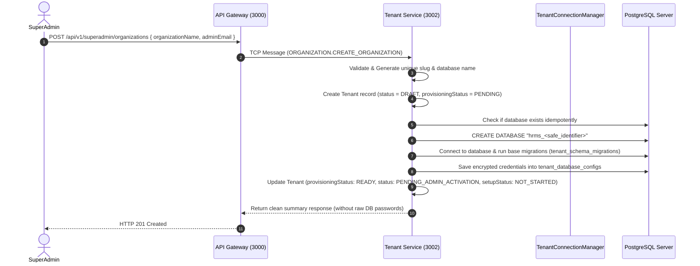
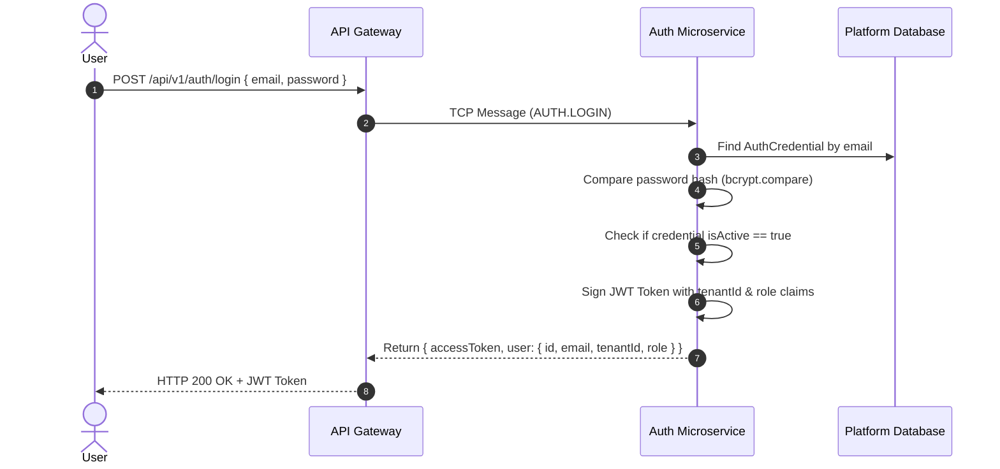
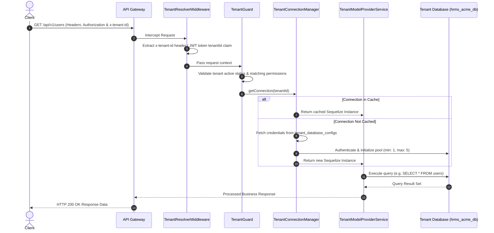
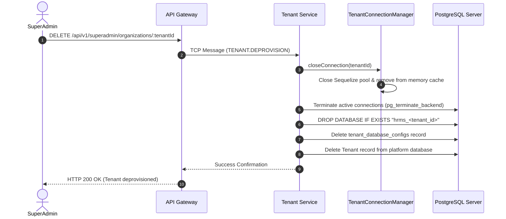

# End-to-End Organization (Tenant) Lifecycle & Execution Flow

> **Document Version**: 1.2.0  
> **Platform**: HRMS Multi-Tenant Microservices System  
> **Target Audience**: Software Engineers, System Architects, & DevOps Engineers  

---

## 1. Core Architectural Principles

> 🔑 **Single Organization Database Rule**:
> `TenantConnectionManager` resolves **one isolated database per tenant organization** (e.g., `hrms_<tenant_id>`). 
> Domain microservices (`user-service`, `tenant-service`, `attendance-service`, `payroll-service`, etc.) access the current organization's database using the validated `TenantContext`.
> 
> **Important**: This architecture does **NOT** create a separate physical database for every microservice per tenant. A single tenant database contains all domain tables for that organization, bound dynamically via `TenantModelProviderService`.

> 🔑 **Tenant Active Lifecycle Rule**:
> Successful database provisioning sets `provisioningStatus = READY`, `status = PENDING_ADMIN_ACTIVATION`, and `setupStatus = NOT_STARTED`.
> Successful database creation does **NOT** automatically mark a tenant as `ACTIVE`. A tenant transitions to `ACTIVE` only after the Organization Admin accepts their invitation, sets a password, and completes the organization setup flow.

---

## 2. High-Level Architecture Flowchart

```
┌──────────────────────────────────────────────────────────────────────────────────┐
│                               1. ONBOARDING PHASE                                │
│                                                                                  │
│   SuperAdmin/User ───► API Gateway ────► Tenant Service ────► DB Provisioning    │
│                           (Port 3000)          (Port 3002)           (PostgreSQL) │
│                                                                      │           │
│                                                                      ▼           │
│                                                          CREATE DATABASE         │
│                                                          hrms_<tenant_id>        │
│                                                                      │           │
│                                                                      ▼           │
│                                                      provisioningStatus: READY   │
│                                                      status: PENDING_ADMIN_...   │
│                                                      setupStatus: NOT_STARTED    │
└──────────────────────────────────────────────────────────────────────┬───────────┘
                                                                       │
┌──────────────────────────────────────────────────────────────────────▼───────────┐
│                               2. REQUEST PHASE                                   │
│                                                                                  │
│   Client Request ───► TenantResolverMiddleware ───► TenantGuard                   │
│   (x-tenant-id)               │                            │                     │
│                               ▼                            ▼                     │
│                   TenantConnectionManager       TenantModelProviderService       │
│                           │                            │                         │
│                           ▼                            ▼                         │
│               [ Get/Cache Tenant DB Connection ] ──► [ Query Tenant Database ]  │
└──────────────────────────────────────────────────────────────────────────────────┘
```

---

## 3. Step-by-Step Execution Phases

---

### Phase 1: Organization Creation & Database Provisioning

The organization creation flow is initiated by SuperAdmin (`POST /api/v1/superadmin/organizations`).



#### Detailed Breakdown:
1. **Request Reception**: SuperAdmin submits organization creation payload (`organizationName`, `adminEmail`, `domain`, etc.).
2. **Slug & Identifier Generation**: Sanitizes organization name to generate unique slug and PostgreSQL database identifier (`hrms_<safe_identifier>`).
3. **Tenant Record Creation**: Creates `Tenant` record with initial status `DRAFT` and `provisioningStatus: PENDING`.
4. **Database Provisioning (`TenantProvisioningService`)**:
   - Checks if database `hrms_<safe_identifier>` already exists.
   - Executes SQL statement: `CREATE DATABASE "hrms_<safe_identifier>";`
   - Runs base schema initialization (`tenant_schema_migrations`) and model table sync (`sequelize.sync({ force: false })`).
   - Stores encrypted connection configuration (`host`, `port`, `dbName`, `username`, `encryptedPassword`) in `tenant_database_configs`.
5. **State Transition**: Updates Tenant record to:
   - `provisioningStatus = TenantProvisioningStatus.READY`
   - `status = TenantStatus.PENDING_ADMIN_ACTIVATION`
   - `setupStatus = TenantSetupStatus.NOT_STARTED`

---

### Phase 2: User Authentication & Login Flow



---

### Phase 3: Tenant Request Resolution & Database Connection Isolation

Every incoming operational request for an organization must be scoped to that specific organization's database.



---

### Phase 4: Role-Based Access Control (RBAC) Enforcement Flow

Inside a tenant's organization, users have specific Roles and Permissions.

```
Incoming Request
       │
       ▼
┌──────────────┐      Valid Header?
│ TenantGuard  │ ─────────────────────────► NO ──► 401 Unauthorized
└──────┬───────┘
       │ YES
       ▼
┌──────────────┐      Role Allowed?
│  RolesGuard  │ ─────────────────────────► NO ──► 403 Forbidden
└──────┬───────┘
       │ YES
       ▼
┌─────────────────┐   Has Required Permission?
│PermissionsGuard │ ─────────────────────────► NO ──► 403 Forbidden
└──────┬──────────┘
       │ YES
       ▼
Execute Controller Handler
```

---

### Phase 5: Organization Offboarding & Deprovisioning Flow

When an organization cancels their subscription or is deactivated by a SuperAdmin:



---

## 4. Summary Table of Microservices Involved

| Microservice | Port | Role in Organization Flow |
| :--- | :--- | :--- |
| **API Gateway** | `3000` | HTTP Entrypoint, Swagger Docs, `x-tenant-id` header extraction, request proxying. |
| **Auth Service** | `3001` | Password hashing, JWT token generation/validation, platform credentials management, OTP. |
| **Tenant Service**| `3002` | Automated PostgreSQL database creation (`CREATE DATABASE`), schema sync, DB config persistence, deprovisioning. |
| **User Service** | `3003` | Tenant-isolated user management, RBAC Roles & Permissions management per tenant DB. |

---

## 5. Verification & Testing

To test Organization Creation locally:

1. **Create Organization via SuperAdmin**:
   ```bash
   curl -X POST http://localhost:3000/api/v1/superadmin/organizations \
     -H "Content-Type: application/json" \
     -H "Authorization: Bearer <superadmin_jwt_token>" \
     -d '{
       "organizationName": "Acme Enterprises",
       "adminEmail": "admin@acme-enterprises.com"
     }'
   ```

2. **Expected Response**:
   ```json
   {
     "tenantId": "c4b12f6a-04b3-4f8a-9892-9653d9e21183",
     "organizationName": "Acme Enterprises",
     "slug": "acme-enterprises",
     "databaseName": "hrms_c4b12f6a_04b3_4f8a_9892_9653d9e21183",
     "status": "PENDING_ADMIN_ACTIVATION",
     "provisioningStatus": "READY",
     "setupStatus": "NOT_STARTED",
     "message": "Organization database 'hrms_c4b12f6a_04b3_4f8a_9892_9653d9e21183' provisioned and initialized successfully. Pending Admin Activation."
   }
   ```
